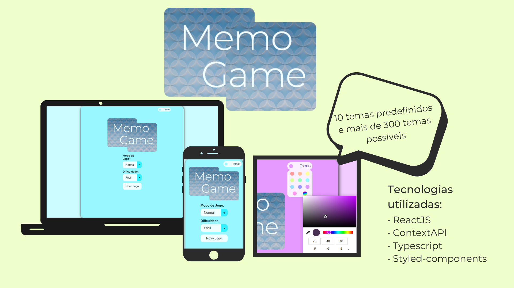

# Memo Game


[Veja o app no Heroku](https://memo-game-caioveira-dev.herokuapp.com/)
### Descrição
Um jogo da memoria com react e styled components. 

## Tecnologias utilizadas
- ReactJs
- ContextApi
- React Hooks
- Typescript
- Styled Components 

### Como instalar (React)

* Para baixar o projeto siga as instruções abaixo:

```
1. git clone https://github.com/CaioVieira-dev/memo-card-game.git
2. cd memo-card-game
```

* Instale as dependências do projeto:

```
3. yarn install
4. yarn start
```

ou

```
3. npm install
4. npm start
```
## Me encontre nas redes sociais
- [Instagram: @caiovieira_dev](https://www.instagram.com/caiovieira_dev/)
- [LinkedIn: Caio Vieira](https://www.linkedin.com/in/caio-vieira-b1aab9201/)

## Licença
Este projeto pode ser usado por qualquer um. Licença MIT.


